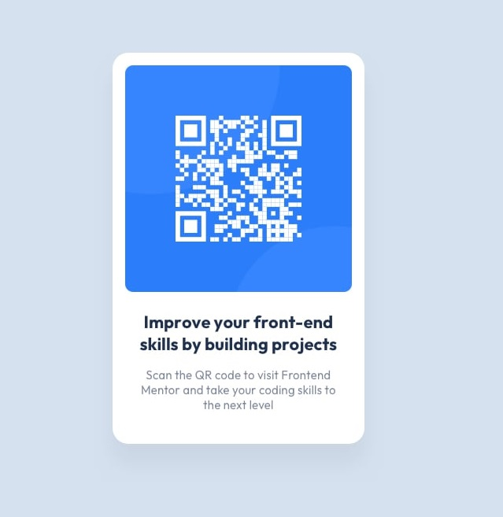

# A challenge on [frontendmentor](https://www.frontendmentor.io)

 
 

# **Challenge Name**

- ### [qr code component main](https://www.frontendmentor.io/solutions/qr-code-component-main-p4wqKZiXKG)

 

## **Layout**

The designs were created to the following widths:

- Mobile: 375px
- Desktop: 1440px
 

## **Links**

- Live Site URL: [click here](https://mahdicodes1.github.io/qr-code-component-main/)

 

## **Built With**

 &nbsp;  &nbsp;

 

## **Tools Used**

 

## **Acknowledgment**

- I'd like to thank [Frontend Mentor](https://www.frontendmentor.io) for this challenge.
